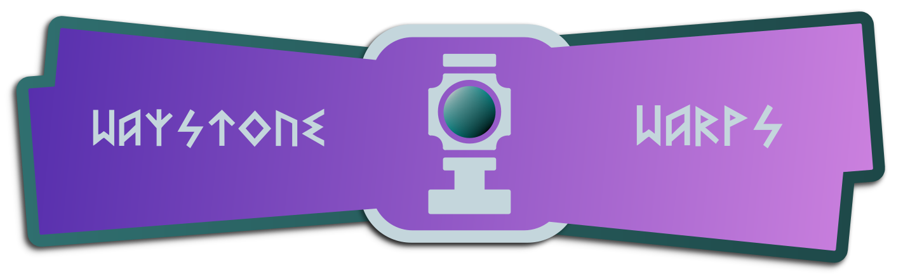

# Waystone Warps

Transform your travels with the Waystone Warps plugin! Craft and place waystones to set up teleportation points throughout your world. Discover new waystones placed by others as you explore and easily teleport between them. Streamline your journey across the world knowing you can always teleport back home in a snap, or simply visit your friends in an instant.

Here are some of the cool features you can expect:
- **Physically Grounded** - Warps are bound via a physical waystone structure in the world, making the experience much more immersive.
- **Intuitive GUI Menus** - Your entire waystone can be managed using click menus. Never need to type a command ever again.
- **Manage Access Easily** - Limit your waystones to only you, open it up to your friends, or leave it out there for the public to find.
- **Teleportation Fees** - Let your players work for it! Change teleportation costs between xp, items, or even a provided economy plugin.

## Installation
Download the latest release (.jar file) from the releases tab and place it in your server's plugins folder. 

For additional functionality such as per player/rank permissions and warp limits, you must install 
[Vault](https://www.spigotmc.org/resources/vault.34315/) as well as a compatible permission and chat
metadata provider. [LuckPerms](https://luckperms.net/) is a recommended plugin for handling both.

## Getting Started
To establish a waystone warp, place down a lodestone on top of a smooth stone block, then right click the lodestone. This opens up a creation menu where you are able to 
name your warp. Once the waystone warp is established, you will be presented with various options to do with warp management.

To discover waystones made by other players, right click a waystone and watch the particles change colours.

To teleport to waystones, right click with a compass in hand. This will bring up a menu listing all your discovered waystons. Click on the waystone of choice to teleport to it.

## Permissions
- waystonewarps.command.warpmenu - Allows the use of the warpmenu command to open up the menu that allows players to teleport to warps.
- waystonewarps.bypass.open_menu - Allows access to open the management menu.
- waystonewarps.bypass.access_control - Allows access to change the access control.
- waystonewarps.bypass.manage_players - Allows access to manage players.
- waystonewarps.bypass.rename - Allows access to rename the waystone.
- waystonewarps.bypass.icon - Allows access to change the waystone icon.
- waystonewarps.bypass.relocate - Allows access to relocate the waystone.
- waystonewarps.admin.invalids.list - Allows usage of the list command.
- waystonewarps.admin.invalids.remove - Allows usage of remove command.
- waystonewarps.admin.invalids.removeall - Allows usage of removeall command.
- waystonewarps.teleport - Allows teleportation
- waystonewarps.teleport.interworld - Allows teleportation to undiscovered warps
- waystonewarps.teleport.cooldown_bypass - Allows bypassing the cooldown timer
- waystonewarps.create - Allow the creation of warps
- waystonewarps.discover - Allow the discovery of warps

## Per Player Limits
Ensure that you have a Vault provider installed to set limits as described out in the installation section. Each Vault 
provider plugin has its own way of implementing this feature. As LuckPerms is the recommended provider, instructions 
will make use of it as such.

To set a metadata for a player, use command:

`/lp group <group_name> meta set <limit_name> <desired_number>`

For groups:

`/lp user <user_name> meta set <limit_name> <desired_number>`

Here are the different limits you can set:
- waystonewarps.warp_limit - Defines how many waystone warps a player can create.
- waystonewarps.teleport_cost - Defines how much it costs to teleport.
- waystonewarps.teleport_timer - Defines how long it takes to teleport.

## Building from Source
### Requirements
- Java JDK 21 or newer
- Git

### Compiling
```
git clone https://gitlab.com/Mizarc/waystonewarps.git
cd waystone-warps/
./gradlew shadowJar
```
Built .jar binary can be found in the `build/libs` folder.

## Support
If you encounter any bugs, crashes, or unexpected behaviour, please [open an issue](https://github.com/mizarc/waystone-warps/issues) in this repository.

## License
Waystone Warps is licensed under the permissive MIT license. Please view [LICENSE](LICENSE) for more info.
